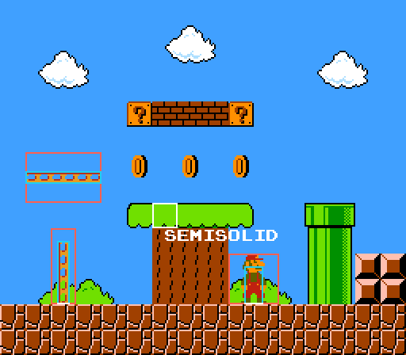

# Game Maker 2 Tile Collision Demo

  

This is a small demo project that demonstrates how to integrate tile collision detection into your GMS2 project. Tile collisions offer many advantages over using object-based collisions, including:

* **Faster mapbuilding** - Collisions are calculated off the tiles themselves, so there is no need to manually align collision objects with map geometry.
* **Better performance** - Tiles do no processing, so it is possible to have millions of them in a room with no performance penalty. Large rooms that would need hundreds of collision objects will see a significant performance increase with moving to tiles.
* **Reduced bugs** - Tiles cannot store state, so two tiles that look the same will always behave exactly the same. Tiles never need to be activated or deactivated.

That being said, there are a few drawbacks to using tile collisions in GMS2 that you will need to be aware of if you adopt this sytem:

* **Multiple physics systems** - Tiles are queried for collisions separately from instances. You can no longer call `instance_place()` to get all solid collisions at a position. The provided `scr_collision_place()` bundles the instance and tile-checking steps into one.
* **More complex collision checks** - Collisions no longer just return `noone` or an instance. If you want detailed information about a collision, you must check if the returned collision struct was a tile or an instance.
* **No tileset UI** - Game Maker offers no UI to configure per-tile properties: you must hand-code tileset data, use an in-engine editor or an external editor like [Tiled](https://www.mapeditor.org/) to associate tile information with your tilesets.

## How does this work?

The `obj_solid` object contains all of the instance variables and events to perform collisions. When an `obj_solid` steps, it applies `vel` to its current `x` and `y` and moves to the new position. After moving, an `obj_solid` will check for any tiles or `obj_solid` instances at its new position. If a collision is found, `obj_solid` rewinds its position and ejects itself from the hitbox.

This system is called **responsive collision detection**: the object moves to the new position, then responds by rewinding. This is in contrast to **predictive collision detection**, where objects move pixel by pixel and stop before colliding. Responsive collision detection is more performant than predictive collision detection and scales up to large numbers of fast-moving objects very well.

If you need to perform ad-hoc collision checks outside of the `obj_solid` step event, the `scr_collision_***` family of scripts provide this.

### Features

- [x] Solid object and tile collisions
- [x] Semisolid and moving collisions
- [x] Standing detection
- [x] Custom room border behavior 
- [x] Visual physics debugging
- [ ] Synced moving platform movement
- [ ] Crush detection and response
- [ ] Custom tile behaviors
- [ ] In-engine tileset editor
- [ ] Slopes
- [ ] Nicer assets and animations
